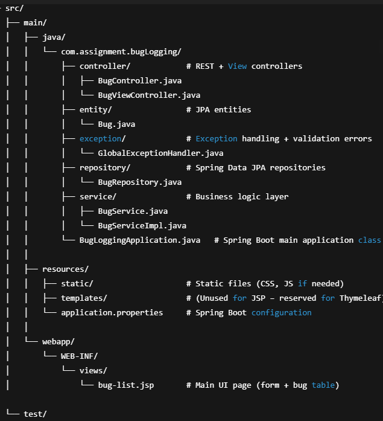

### Bug Logging System – Spring MVC + JSP + MySQL

A simple Bug Logging web application built with Spring Boot (Spring MVC), JSP, jQuery AJAX, Hibernate/JPA, MySQL, and Docker.
This project demonstrates clean backend design, TDD workflows, CI-friendly builds, and a simple AJAX-powered UI.

**Project Overview**

The system allows users to:
* Submit a new bug (title, description, severity, status)
* View all logged bugs
* Filter bugs by severity (AJAX, no page reload)
* Configure server URL so UI/Client can run separately from the backend
 
Technologies used:

* Java 17+ (compatible with Java 8+ requirement)
* Spring Boot (MVC)
* Hibernate/JPA
* MySQL
* JSP + jQuery
* JUnit 5 + Mockito + Spring Test
* Docker Compose (MySQL + application)

### 1. Getting Started

This section helps a new developer install tools, build the project, and run it locally or via Docker.

###### 1.1 Prerequisites

Ensure the following are installed:
* Java  : 17 or 11 (code compatible with Java 8+)
* Maven	: 3.8+
* MySQL	: Local install or Docker MySQL
* IntelliJ IDEA	: (Recommended)

###### 1.2 Clone the repository

git clone https://github.com/aceorana/bug-logging/

cd bug-logging

### 2. Configuration

All primary settings are in:
src/main/resources/application.properties

###### Database Configuration
* spring.datasource.url=jdbc:mysql://localhost:3306/bugtracker?useSSL=false&allowPublicKeyRetrieval=true&serverTimezone=UTC
* spring.datasource.username=buguser
* spring.datasource.password=bugpass
* spring.jpa.hibernate.ddl-auto=update
* spring.jpa.show-sql=true
* spring.jpa.properties.hibernate.dialect=org.hibernate.dialect.MySQLDialect

###### JSP View Resolver
* spring.mvc.view.prefix=/WEB-INF/views/
* spring.mvc.view.suffix=.jsp

### 3. Database Setup

If using local MySQL, run:

 CREATE DATABASE bugtracker CHARACTER SET utf8mb4 COLLATE utf8mb4_unicode_ci;

 CREATE USER 'buguser'@'%' IDENTIFIED BY 'bugpass';

 GRANT ALL PRIVILEGES ON bugtracker.* TO 'buguser'@'%';

 FLUSH PRIVILEGES;

### 4. Building the Project

To compile and run all tests:
* mvn clean test

Build the WAR:
* mvn clean package

Run the application:
* mvn spring-boot:run

Server starts at:
* http://localhost:8080

### 5. Project Structure Overview

### 6. REST API Documentation

###### POST /api/bugs
Create a new bug.

###### Request Body (JSON):
{
"title": "UI Crash",
"description": "Clicking Save crashes the app",
"severity": "HIGH",
"status": "OPEN"
}

###### Responses:
201 Created – Bug saved
400 Bad Request – Validation failed

###### GET /api/bugs
Returns all bugs.

###### GET /api/bugs?severity=HIGH
Returns filtered bugs by severity.

### 7. Frontend (JSP + jQuery AJAX)
The frontend uses:
* bug-list.jsp
* jQuery AJAX for: 
  * Form submission (no reload)
  * Dynamic bug table loading 
  * Severity dropdown filter

###### Configurable server URL:
    

This allows the frontend and backend to run on different VMs, which is required by the reviewers.

### 8. Running with Docker

This project includes Docker support (app + MySQL).

###### 8.1 Build app WAR
    mvn clean package

###### 8.2 Start containers
    docker-compose up --build

###### Services started:
Service and	URL 
* MySQL   :	localhost:3306 
* App     : http://localhost:8080

The Docker Compose file includes health checks so the app waits until MySQL is ready.

### 9. Testing
######    Unit Tests
* BugServiceTest 
* BugControllerTest (using MockMvc)

###### Persistence Tests
* @DataJpaTest JPA repository tests

###### Integration Tests
* @SpringBootTest
* Optional Testcontainers-based tests (disabled if Docker not running)

###### Run all tests:
    mvn clean verify

### 10. How Client–Server Configuration Works
* Server on VM A (e.g., 10.10.1.5)
* Client/UI on VM B (e.g., 10.10.1.9)

To configure:

In application.properties file:

api.base-url=http://10.10.1.5:8080

This allows cross-VM execution as required in the spec.

### 11. CI/CD Notes (GitHub Actions)

A default workflow is included:
* Runs on every push
* Builds using Maven Wrapper (mvnw)
* Runs tests
* Ensures the project is buildable on fresh environments

### 12. Troubleshooting
###### MySQL connection issue
Check:
* MySQL is running
* User/password are correct
* Port 3306 is open
* For Docker: run docker logs db

###### JSP not loading / whitelabel page
Check:
* View resolver prefix/suffix
* JSP located under WEB-INF/views
* Controller returning correct view name
* JSP dependencies are in the pom file.

###### Testcontainers failing in CI

CI may not have Docker-in-Docker enabled.

Tests can be disabled via:
* @DisabledIfEnvironmentVariable(named = "CI", matches = "true")
* or using conditional disabledWithoutDocker (used in this project at BugIntegrationTest.java.

### 13. License
This project is for technical assessment and educational use.